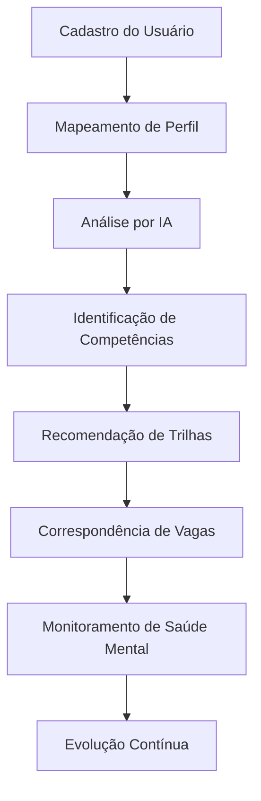
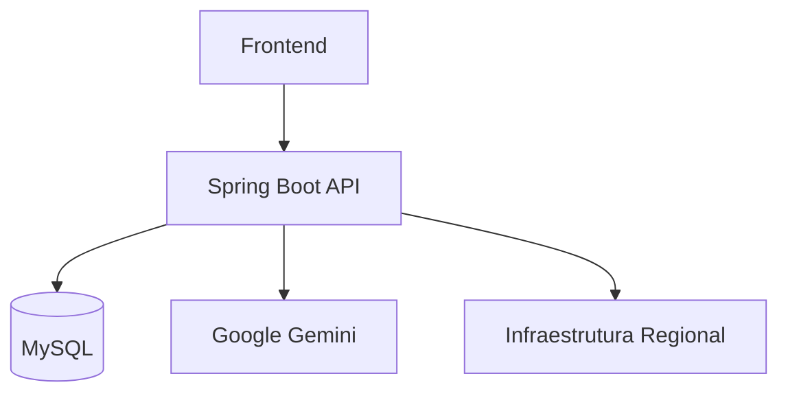

# 🌐 BiT App — Ecossistema Inteligente de Desenvolvimento Humano e Profissional

<p align="center">
  
</p>

<p align="center">
  <strong>Conectando pessoas, oportunidades e bem-estar através da tecnologia.</strong>
</p>

<p align="center">
  Desenvolvido durante o Hackathon No Country 2026 • Grupo 68
</p>

---

# 📖 Sobre o Projeto

O **BiT App** é uma plataforma digital desenvolvida para promover inclusão, desenvolvimento profissional e qualidade de vida através de uma abordagem integrada e inteligente.

Diferente das plataformas tradicionais focadas apenas em empregabilidade, o BiT App atua como um **ecossistema 360°**, conectando:

✅ Formação Profissional

✅ Orientação de Carreira

✅ Empregabilidade

✅ Saúde Mental

✅ Infraestrutura Tecnológica Regional

✅ Inteligência Artificial

Nosso objetivo é reduzir barreiras de acesso ao mercado de trabalho, oferecendo recomendações personalizadas, suporte emocional preventivo e acesso inteligente a oportunidades compatíveis com o perfil de cada usuário.

---

# 🎯 Problema

Milhões de pessoas enfrentam desafios simultâneos ao buscar crescimento profissional:

* Falta de orientação de carreira;
* Dificuldade para identificar lacunas técnicas;
* Pouco acesso a mentorias qualificadas;
* Escassez de oportunidades compatíveis;
* Problemas emocionais causados por pressão profissional;
* Limitações de infraestrutura digital em determinadas regiões.

Atualmente essas soluções encontram-se fragmentadas em diversas plataformas.

O **BiT App unifica toda essa jornada em um único ambiente inteligente.**

---

# 💡 Nossa Solução

O BiT App utiliza Inteligência Artificial, análise geográfica e dados de infraestrutura para criar uma experiência personalizada de desenvolvimento humano e profissional.

## Fluxo Principal



---

# 🚀 Funcionalidades

## 🧠 Orientação de Carreira com IA

O sistema analisa:

* Hard Skills
* Soft Skills
* Experiências anteriores
* Objetivos profissionais

Gerando:

* Mapeamento de lacunas técnicas;
* Recomendações de estudo;
* Trilhas de aprendizado personalizadas;
* Sugestões de evolução profissional.

### Exemplo

```text
Objetivo: Desenvolvedor Backend Java

Compatibilidade Atual: 72%

Competências Necessárias:

✔ Java
✔ Spring Boot
✔ SQL

Competências Recomendadas:

➜ Docker
➜ AWS
➜ Testes Automatizados
```

---

## 💼 Match Inteligente de Oportunidades

O BiT App conecta usuários a oportunidades compatíveis com seu perfil.

Critérios utilizados:

* Competências técnicas;
* Objetivos profissionais;
* Geolocalização;
* Disponibilidade regional;
* Infraestrutura de conectividade.

---

## ❤️ Saúde Mental com CNV

A plataforma realiza check-ins emocionais periódicos utilizando princípios da Comunicação Não Violenta (CNV).

### Benefícios

* Escuta ativa;
* Acolhimento humanizado;
* Identificação precoce de sinais de sofrimento emocional;
* Encaminhamento para canais oficiais de apoio.

### Exemplo

```text
Como você está se sentindo hoje?

😀 Muito Bem
🙂 Bem
😐 Neutro
😔 Triste
😫 Sobrecarregado
```

---

## 📡 Mapeamento de Infraestrutura Regional

O sistema permite registrar e monitorar:

* Cobertura 3G
* Cobertura 4G
* Cobertura 5G
* Densidade populacional
* Disponibilidade de acesso digital

Esses dados auxiliam na distribuição de oportunidades e estratégias de inclusão digital.

---

## 🛡️ Motor Inteligente de Contingência

Uma das principais inovações do projeto.

Caso serviços externos apresentem indisponibilidade ou atinjam limites de uso:

```text
Google Gemini indisponível
          ↓
Motor de Contingência
          ↓
Experiência preservada
```

O usuário continua utilizando a plataforma normalmente.

---

# 🏗️ Arquitetura da Solução



---

# 🛠️ Stack Tecnológica

## Backend

* Java 21 LTS
* Spring Boot 3.3.4
* Spring Data JPA
* Hibernate ORM
* Maven

## Banco de Dados

* MySQL Server
* H2 Database

## Inteligência Artificial

* Google Gemini 1.5 Flash

## Frontend

* Thymeleaf
* HTML5
* Tailwind CSS
* JavaScript

## Bibliotecas

* Jackson Databind
* JTS Topology Suite

---

# ⚙️ Instalação

## Pré-requisitos

* Java JDK 21+
* Maven 3+
* MySQL Server

---

## Clone o Repositório

```bash
git clone https://github.com/No-Country-simulation/S06-26-AB-EQUIPE-68.git

cd S06-26-AB-EQUIPE-68
```

---

## Configure a Chave Gemini

```env
GEMINI_API_KEY=sua_chave_aqui
```

---

## Compile o Projeto

```bash
mvn clean compile
```

---

## Execute

```bash
mvn spring-boot:run
```

---

## Acesso

```text
http://localhost:8080
```

---

# 📈 Diferenciais Competitivos

| Funcionalidade          | Soluções Tradicionais | BiT App |
| ----------------------- | --------------------- | ------- |
| Empregabilidade         | ✅                     | ✅       |
| Orientação de Carreira  | ❌                     | ✅       |
| IA Integrada            | ❌                     | ✅       |
| Saúde Mental            | ❌                     | ✅       |
| Infraestrutura Regional | ❌                     | ✅       |
| Sistema de Contingência | ❌                     | ✅       |
| Visão 360° do Usuário   | ❌                     | ✅       |

---

# 🔮 Evoluções Futuras

* Aplicativo Mobile Flutter
* Dashboard Analítico Avançado
* Sistema de Mentorias
* Gamificação
* Integração com LinkedIn
* Marketplace de Cursos
* Recomendação Preditiva de Carreira
* Assistente Virtual Multimodal

---

# 👨‍💻 Equipe de Desenvolvimento

### Andre Teixeira

**Backend Developer & Tech Leader**

### Carlos Alexandre

**Full Stack Developer**

### Tiago Farias

**AI Engineer**

### Daniela Vieira

**QA Engineer**

---

# 🏆 Hackathon No Country 2026

Projeto desenvolvido durante a simulação de ambiente profissional da No Country.

O BiT App demonstra como Inteligência Artificial, inclusão digital e desenvolvimento humano podem trabalhar juntos para gerar impacto social real.

---

# 📄 Licença

Projeto desenvolvido exclusivamente para fins acadêmicos, educacionais e avaliação dentro do programa No Country Simulation 2026.
