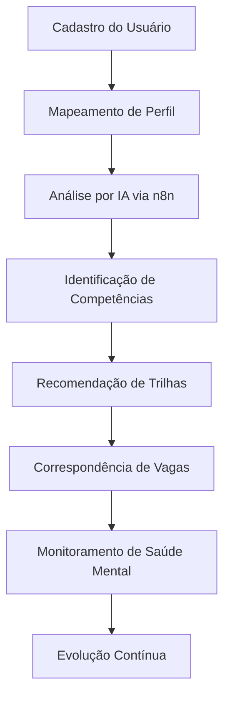
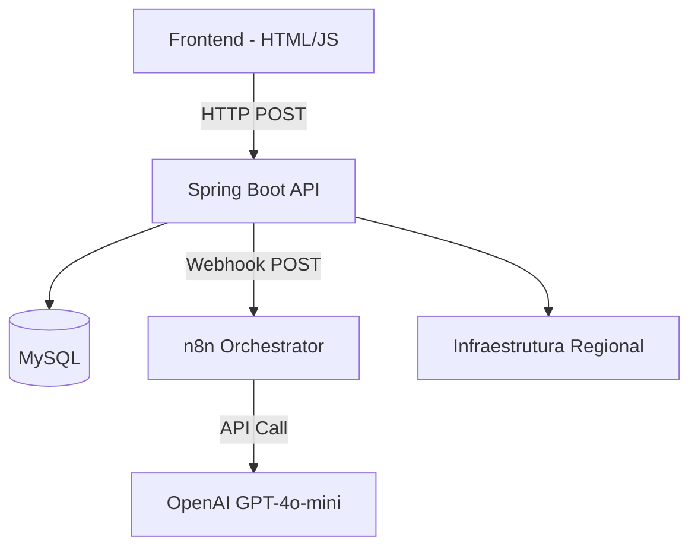

# 🌐 BiT App — Ecossistema Inteligente de Desenvolvimento Humano e Profissional

<p align="center">
  
</p>

<p align="center">
  <strong>Conectando pessoas, oportunidades e bem-estar através da tecnologia.</strong>
</p>

<p align="center">
  Desenvolvido durante o Hackathon No Country 2026 • Grupo 68
</p>

---

# 📖 Sobre o Projeto

O **BiT App** é uma plataforma digital desenvolvida para promover inclusão, desenvolvimento profissional e qualidade de vida através de uma abordagem integrada e inteligente.

Diferente das plataformas tradicionais focadas apenas em empregabilidade, o BiT App atua como um **ecossistema 360°**, conectando:

✅ Formação Profissional

✅ Orientação de Carreira

✅ Empregabilidade

✅ Saúde Mental

✅ Infraestrutura Tecnológica Regional

✅ Inteligência Artificial via n8n Orchestrator

Nosso objetivo é reduzir barreiras de acesso ao mercado de trabalho, oferecendo recomendações personalizadas, suporte emocional preventivo e acesso inteligente a oportunidades compatíveis com o perfil de cada usuário.

---

# 🎯 Problema

Milhões de pessoas enfrentam desafios simultâneos ao buscar crescimento profissional:

* Falta de orientação de carreira;
* Dificuldade para identificar lacunas técnicas;
* Pouco acesso a mentorias qualificadas;
* Escassez de oportunidades compatíveis;
* Problemas emocionais causados por pressão profissional;
* Limitações de infraestrutura digital em determinadas regiões.

Atualmente essas soluções encontram-se fragmentadas em diversas plataformas.

O **BiT App unifica toda essa jornada em um único ambiente inteligente.**

---

# 💡 Nossa Solução

O BiT App utiliza Inteligência Artificial, análise geográfica e dados de infraestrutura para criar uma experiência personalizada de desenvolvimento humano e profissional.

## Fluxo Principal



---

# 🚀 Funcionalidades

## 🧠 Orientação de Carreira com IA

O sistema analisa:

* Hard Skills
* Soft Skills
* Experiências anteriores
* Objetivos profissionais

Gerando:

* Mapeamento de lacunas técnicas;
* Recomendações de estudo;
* Trilhas de aprendizado personalizadas;
* Sugestões de evolução profissional.

### Endpoint

```http
POST /api/assessment?usuarioId=1
Content-Type: application/json

{
  "nome": "João Silva",
  "idade": 25,
  "escolaridade": "Superior incompleto",
  "experiencia": "1 ano de estágio",
  "hardSkills": ["Java", "Spring Boot", "SQL"],
  "softSkills": ["Comunicação", "Trabalho em equipe"],
  "tecnologias": ["VS Code", "Git", "Docker"],
  "tipo": "assessment"
}
```

### Resposta

```json
{
  "success": true,
  "data": {
    "compatibilidade": 72,
    "nivel": "Júnior Pleno",
    "pontosFortes": ["Java", "Spring Boot"],
    "gaps": ["Docker", "AWS"],
    "planoDesenvolvimento": ["Estudar containerização", "Certificações cloud"]
  }
}
```

---

## 💼 Match Inteligente de Oportunidades

O BiT App conecta usuários a oportunidades compatíveis com seu perfil.

Critérios utilizados:

* Competências técnicas;
* Objetivos profissionais;
* Geolocalização;
* Disponibilidade regional;
* Infraestrutura de conectividade.

---

## ❤️ Saúde Mental com CNV

A plataforma realiza check-ins emocionais periódicos utilizando princípios da Comunicação Não Violenta (CNV), processados pelo agente de Saúde Mental via n8n.

### Benefícios

* Escuta ativa;
* Acolhimento humanizado;
* Identificação precoce de sinais de sofrimento emocional;
* Encaminhamento para canais oficiais de apoio (CVV 188).

### Endpoint

```http
POST /api/mental-health?usuarioId=1
```

### Resposta

```json
{
  "success": true,
  "data": {
    "nivel": "estavel",
    "alerta": "Usuário apresenta bom humor geral",
    "recomendacoes": ["Manter rotina de estudos", "Praticar atividades físicas"],
    "acoes": ["Reserve 10 minutos para mindfulness", "Liste 3 conquistas da semana"],
    "canaisApoio": ["CVV - Disque 188", "CAPS do município"],
    "derivarCvv": false,
    "scoreRisco": 2
  }
}
```

---

## 📡 Mapeamento de Infraestrutura Regional

O sistema permite registrar e monitorar:

* Cobertura 3G
* Cobertura 4G
* Cobertura 5G
* Densidade populacional
* Disponibilidade de acesso digital

Esses dados auxiliam na distribuição de oportunidades e estratégias de inclusão digital.

---

## 🛡️ Motor Inteligente de Contingência

Uma das principais inovações do projeto.

Caso o n8n ou a OpenAI estejam indisponíveis, o backend gera respostas localmente:

```text
n8n indisponível
          ↓
Fallback Local (AssessmentService / MentalHealthService)
          ↓
Experiência preservada
```

O usuário continua utilizando a plataforma normalmente com dados gerados pelo backend.

---

# 🏗️ Arquitetura da Solução



## Fluxo de Dados

```text
Frontend (HTML/JS)
       │
       │ POST /api/assessment ou /api/mental-health
       v
Backend (Spring Boot - porta 8080)
       │
       │ POST http://bitapp-n8n:5678/webhook/bit/agent
       v
n8n Workflow (GPT-4o-mini)
       │
       │ Classifica intent → Assessment Agent ou Mental Health Agent
       │ Retorna JSON no formato do DTO
       v
Backend persiste no MySQL e retorna ao Frontend
```

---

# 🛠️ Stack Tecnológica

## Backend

* Java 21 LTS
* Spring Boot 3.3.4
* Spring Data JPA
* Hibernate ORM
* Spring Security + JWT
* Maven

## Banco de Dados

* MySQL 8.4

## Inteligência Artificial

* n8n Workflow Orchestrator
* OpenAI GPT-4o-mini (via n8n)

## Frontend

* HTML5
* Tailwind CSS
* JavaScript (Vanilla)

## Infraestrutura

* Docker + Docker Compose
* Multi-stage Dockerfile (Maven build + JRE runtime)

---

# ⚙️ Instalação

## Pré-requisitos

* Docker Desktop
* Chave API OpenAI com saldo

---

## Clone o Repositório

```bash
git clone https://github.com/No-Country-simulation/S06-26-AB-EQUIPE-68.git

cd S06-26-AB-EQUIPE-68
```

---

## Configure as Variáveis de Ambiente

Crie o arquivo `.env.production` na raiz:

```env
# MySQL
DB_URL=jdbc:mysql://bitapp-mysql:3306/db_bitapp?createDatabaseIfNotExist=true&useSSL=false&allowPublicKeyRetrieval=true&serverTimezone=UTC
DB_DRIVER=com.mysql.cj.jdbc.Driver
DB_USERNAME=root
DB_PASSWORD=123456

# N8N
N8N_ASSESSMENT_URL=http://bitapp-n8n:5678/webhook/bit/agent
N8N_MENTAL_HEALTH_URL=http://bitapp-n8n:5678/webhook/bit/agent
N8N_TIMEOUT=10000
N8N_MAX_RETRIES=3

# JWT
JWT_SECRET=sua_chave_secreta_aqui
JWT_EXPIRATION=86400000
JWT_REFRESH_EXPIRATION=604800000

# OpenAI (obrigatório)
OPENAI_API_KEY=sua_chave_openai_aqui

# Spring
SPRING_PROFILES_ACTIVE=prod
```

---

## Execute com Docker

```bash
docker-compose up -d --build
```

---

## Configure o n8n (Primeira Vez)

1. Acesse `http://localhost:5679`
2. Crie a conta de administrador
3. Vá em **Settings > Credentials > Add Credential**
4. Busque "OpenAI API" e cole sua chave
5. Vá em **Workflows > Import from File**
6. Selecione `n8n/bitapp-agent-workflow.json`
7. Nos 3 nodes OpenAI, vincule a credencial criada
8. Ative o workflow (toggle Active = ON)

---

## Portas

| Serviço   | Porta | URL                        |
| --------- | ----- | -------------------------- |
| Frontend  | 5173  | http://localhost:5173      |
| Backend   | 8080  | http://localhost:8080      |
| n8n       | 5679  | http://localhost:5679      |
| MySQL     | 3307  | localhost:3307             |

---

## Comandos Uteis

```bash
# Reiniciar tudo
docker-compose restart

# Ver logs
docker-compose logs -f n8n
docker-compose logs -f backend

# Parar tudo
docker-compose down

# Rebuild completo
docker-compose up -d --build --force-recreate
```

---

# 📡 Endpoints da API

| Método | Endpoint                     | Descrição                     | N8N     |
| ------ | ---------------------------- | ----------------------------- | ------- |
| POST   | `/api/auth/register`         | Cadastro de usuário           | Não     |
| POST   | `/api/auth/login`            | Login (JWT)                   | Não     |
| GET    | `/api/auth/me`               | Dados do usuário logado       | Não     |
| POST   | `/api/assessment`            | Avaliação profissional        | Sim     |
| POST   | `/api/mental-health`         | Check-in saúde mental         | Sim     |
| POST   | `/api/orientar`              | Orientação de carreira        | Não     |
| POST   | `/api/saude`                 | Check-in de saúde legado      | Não     |
| GET    | `/api/vagas`                 | Listar vagas                  | Não     |
| GET    | `/api/cursos`                | Listar cursos                 | Não     |
| GET    | `/api/usuarios`              | Listar usuários               | Não     |
| GET    | `/api/network-status/:id`    | Status de infraestrutura      | Não     |

---

# 📈 Diferenciais Competitivos

| Funcionalidade          | Soluções Tradicionais | BiT App |
| ----------------------- | --------------------- | ------- |
| Empregabilidade         | ✅                     | ✅       |
| Orientação de Carreira  | ❌                     | ✅       |
| IA Integrada (n8n)      | ❌                     | ✅       |
| Saúde Mental            | ❌                     | ✅       |
| Infraestrutura Regional | ❌                     | ✅       |
| Sistema de Contingência | ❌                     | ✅       |
| Visão 360° do Usuário   | ❌                     | ✅       |
| Auth JWT Segura         | ❌                     | ✅       |
| Orquestração via n8n    | ❌                     | ✅       |

---

# 🔮 Evoluções Futuras

* Aplicativo Mobile Flutter
* Dashboard Analítico Avançado
* Sistema de Mentorias
* Gamificação
* Integração com LinkedIn
* Marketplace de Cursos
* Recomendação Preditiva de Carreira
* Assistente Virtual Multimodal

---

# 👨‍💻 Equipe de Desenvolvimento

### Andre Teixeira

**Backend Developer & Tech Leader**

### Carlos Alexandre

**Full Stack Developer**

### Tiago Farias

**AI Engineer**

### Daniela Vieira

**QA Engineer**

---

# 🏆 Hackathon No Country 2026

Projeto desenvolvido durante a simulação de ambiente profissional da No Country.

O BiT App demonstra como Inteligência Artificial, inclusão digital e desenvolvimento humano podem trabalhar juntos para gerar impacto social real.

---

# 📄 Licença

Projeto desenvolvido exclusivamente para fins acadêmicos, educacionais e avaliação dentro do programa No Country Simulation 2026.
