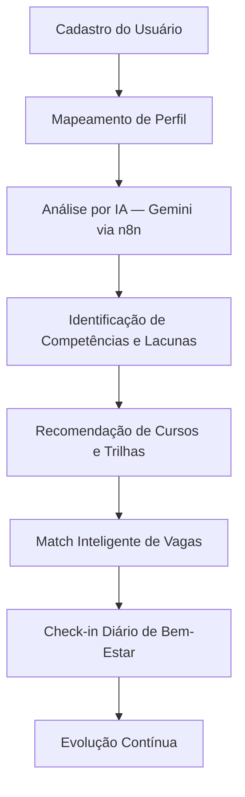
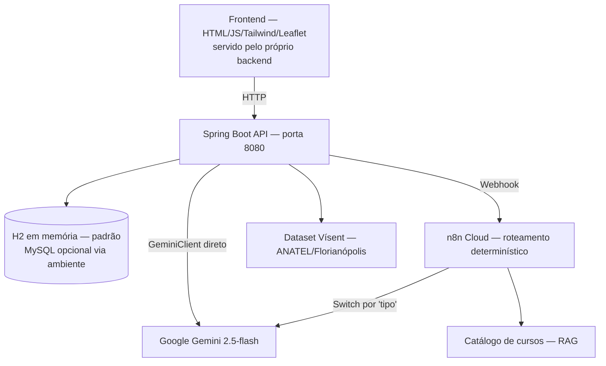

# 🌐 BiT App — Ecossistema Inteligente de Desenvolvimento Humano e Profissional

<p align="center">
  <strong>Conectando pessoas, oportunidades e bem-estar através da tecnologia.</strong>
</p>

<p align="center">
  Desenvolvido durante o Hackathon App BiT (Black in Tech) — Wongola EdTech<br/>
  Parceiros: Oracle Next Education (ONE) e No Country • Equipe 68
</p>

<p align="center">
  🔗 <strong>Demonstração ao vivo:</strong> <a href="https://s06-26-appbit-demo.onrender.com">s06-26-appbit-demo.onrender.com</a><br/>
  <em>Crie sua conta em segundos pelo "Primeiro Acesso". A instância já vem povoada com vagas, cursos e perfis de exemplo.</em><br/>
  <em>Hospedado no plano gratuito do Render: o primeiro acesso após inatividade pode levar ~1 minuto para o serviço acordar.</em>
</p>

---

# 📖 Sobre o Projeto

O **BiT App** é uma plataforma digital desenvolvida para promover inclusão, desenvolvimento profissional e qualidade de vida através de uma abordagem integrada e inteligente.

Diferente das plataformas tradicionais focadas apenas em empregabilidade, o BiT App atua como um **ecossistema 360°**, conectando:

✅ Formação Profissional

✅ Orientação de Carreira

✅ Empregabilidade

✅ Saúde Mental

✅ Infraestrutura Tecnológica Regional

✅ Inteligência Artificial (Google Gemini, orquestrada via n8n)

Nosso objetivo é reduzir barreiras de acesso ao mercado de trabalho, oferecendo recomendações personalizadas, suporte emocional preventivo e acesso inteligente a oportunidades compatíveis com o perfil de cada usuário.

---

# 🎯 Problema

Milhões de pessoas enfrentam desafios simultâneos ao buscar crescimento profissional:

* Falta de orientação de carreira;
* Dificuldade para identificar lacunas técnicas;
* Escassez de oportunidades compatíveis;
* Problemas emocionais causados por pressão profissional;
* Limitações de infraestrutura digital em determinadas regiões.

Atualmente essas soluções encontram-se fragmentadas em diversas plataformas.

O **BiT App unifica toda essa jornada em um único ambiente inteligente.**

---

# 💡 Nossa Solução

O BiT App utiliza Inteligência Artificial, análise geográfica e dados reais de infraestrutura de rede para criar uma experiência personalizada de desenvolvimento humano e profissional.

## Fluxo Principal


```mermaid
flowchart TD

A[Cadastro do Usuário] --> B[Mapeamento de Perfil]

B --> C[Análise por IA — Gemini via n8n]

C --> D[Identificação de Competências e Lacunas]

D --> E[Recomendação de Cursos e Trilhas]

E --> F[Match Inteligente de Vagas]

F --> G[Check-in Diário de Bem-Estar]

G --> H[Evolução Contínua]
```

---

# 🚀 Funcionalidades

## 🧠 Orientação de Carreira com IA

O sistema analisa hard skills, soft skills, experiências e objetivos do usuário, gerando mapeamento de lacunas técnicas, recomendações de estudo e plano de desenvolvimento personalizado. A análise é feita pelo agente de orientação (Gemini 2.5-flash via n8n), enriquecida em tempo real com o catálogo de cursos da própria plataforma (RAG).

### Endpoint

```http
POST /api/assessment?usuarioId=1
Content-Type: application/json

{
  "nome": "João Silva",
  "idade": 25,
  "escolaridade": "Superior incompleto",
  "experiencia": "1 ano de estágio",
  "hardSkills": ["Java", "Spring Boot", "SQL"],
  "softSkills": ["Comunicação", "Trabalho em equipe"],
  "tecnologias": ["VS Code", "Git", "Docker"],
  "tipo": "assessment",
  "idioma": "pt"
}
```

### Resposta

```json
{
  "success": true,
  "data": {
    "compatibilidade": 72,
    "nivel": "Júnior Pleno",
    "pontosFortes": ["Java", "Spring Boot"],
    "gaps": ["Docker", "AWS"],
    "planoDesenvolvimento": ["Estudar containerização", "Certificações cloud"]
  }
}
```

---

## 💼 Match Inteligente de Oportunidades

O BiT App conecta usuários a vagas compatíveis com seu perfil por **correspondência de competências**: um tokenizador dedicado compara as skills do usuário com os requisitos de cada vaga (tratando variações como termos entre parênteses, separadores "/", "e", "ou") e calcula o percentual de compatibilidade — individual (`/api/vagas/{id}/match`) ou em lote para todas as vagas (`/api/vagas/match-lote`).

---

## ❤️ Saúde Mental com protocolo CVV

A plataforma acompanha o bem-estar do usuário com **check-ins diários por nota** (escala ordinal: 9, 7, 5, 3, 1), acolhimento humanizado gerado pelo agente de saúde mental (Gemini via n8n) e encaminhamento aos canais oficiais de apoio — **CVV, Disque 188** — presente em todas as páginas da aplicação.

### 🛡️ Invariante de segurança

**A decisão de encaminhar ao CVV é 100% determinística e acontece exclusivamente no backend Java — a IA nunca participa dessa decisão.** As regras são código auditável:

* Notas mais baixas da escala disparam acolhimento e derivação **imediatos**;
* O sistema agrega a **pior nota de cada dia** e monitora a **tendência da semana** (padrão persistente de notas baixas em 3 dos últimos 5 dias também gera derivação);
* A IA atua apenas na camada de linguagem (mensagem de acolhimento e leitura emocional), nunca na regra de segurança — se a IA estiver indisponível, a proteção continua funcionando.

### Endpoints

```http
POST /api/saude
Content-Type: application/json

{
  "usuarioId": 1,
  "nota": 9,
  "contexto": "Consegui terminar meu projeto hoje",
  "idioma": "pt"
}
```

### Resposta

```json
{
  "success": true,
  "data": {
    "mensagem": "Que ótimo saber que o dia rendeu! Comemorar as conquistas também faz parte da jornada.",
    "acaoSugerida": "Anote o que funcionou hoje para repetir amanhã.",
    "derivarCvv": false,
    "nota": 9,
    "alerta": null,
    "nivelDerivacao": null,
    "leituraEmocional": "Dia produtivo e ânimo elevado.",
    "tendenciaSemana": false
  }
}
```

Quando há sinal de risco, `nivelDerivacao` é preenchido pelo backend e `derivarCvv` passa a `true`, acionando o fluxo de apoio. O histórico de check-ins fica disponível em `GET /api/saude/historico?usuarioId=1`.

---

## 📡 Infraestrutura Regional com Dados Reais

O sistema ingere o **dataset Vísent** — medições reais de antenas homologadas pela ANATEL na região de Florianópolis (132 antenas, milhares de registros de tráfego por período) — e permite consultar a qualidade de conectividade na região do usuário via `GET /api/network-status/{usuarioId}`. Esses dados contextualizam a distribuição de oportunidades e as estratégias de inclusão digital.

---

## 🗺️ Mapa de Lazer e Bem-Estar

Mapa interativo (Leaflet) com pontos reais de lazer em Florianópolis, geolocalização do usuário e **cálculo de rota** até o destino escolhido (roteamento via OpenRouteService, chamado com segurança pelo backend em `POST /api/rota` — a chave nunca vai ao navegador).

---

## 🎓 Cursos com Geolocalização e Inscrição

Catálogo de cursos com filtros por região, gratuidade e instituições beneficentes, incluindo unidades **presenciais reais de Florianópolis com coordenadas** — integradas ao mapa — e fluxo de inscrição (`POST /api/cursos/inscrever`).

---

## 🌎 Internacionalização (PT/ES)

Interface e respostas dos agentes de IA em **português e espanhol**. A preferência é definida no cadastro, aplicada no login e enviada aos agentes pelo campo `idioma`.

---

## 🛡️ Motor Inteligente de Contingência

Caso o n8n ou o Gemini estejam indisponíveis, o backend gera respostas localmente:

```text
IA indisponível (n8n / Gemini)
          ↓
Fallback local (OrientacaoService / SaudeMentalService)
          ↓
Experiência preservada — e a regra de segurança do CVV,
por ser local e determinística, nunca sai do ar
```
> **Limitação conhecida:** o workflow n8n exportado em `n8n/` referencia a URL
> do serviço via valor fixo no nó de catálogo. Ao importar em outra instância,
> ajuste a URL do nó "Buscar Catálogo (RAG)" para o seu deploy.
---

## 🎬 Modo Demonstração

Com a variável `DEMO_SEED=true`, a aplicação sobe povoada com 6 perfis realistas, check-ins históricos e uma vaga-âncora com compatibilidade 100% — ideal para avaliação sem depender de cadastro manual. Por padrão (`false`), nada é semeado além dos catálogos.

---

# 🏗️ Arquitetura da Solução


```mermaid
graph TD

UI[Frontend — HTML/JS/Tailwind/Leaflet<br/>servido pelo próprio backend]

API[Spring Boot API — porta 8080]

DB[(H2 em memória — padrão<br/>MySQL opcional via ambiente)]

N8N[n8n Cloud — roteamento determinístico]

AI[Google Gemini 2.5-flash]

RAG[Catálogo de cursos — RAG]

VISENT[Dataset Vísent — ANATEL/Florianópolis]

UI -->|HTTP| API
API --> DB
API -->|Webhook| N8N
N8N -->|Switch por 'tipo'| AI
N8N --> RAG
API -->|GeminiClient direto| AI
API --> VISENT
```

## Fluxo de Dados da IA

```text
Frontend
   │  POST /api/assessment  ou  POST /api/saude
   v
Backend Spring Boot (8080)
   │  deriva segurança do CVV localmente (determinístico)
   │  envia payload estruturado (hardSkills, humor, contexto, tipo, idioma)
   v
n8n Cloud — Switch determinístico pelo campo "tipo"
   ├── agente de orientação  → Gemini 2.5-flash (+ RAG no catálogo de cursos)
   └── agente de saúde mental → Gemini 2.5-flash (linguagem de acolhimento)
   v
Backend valida, persiste e responde ao Frontend
(se qualquer etapa de IA falhar → fallback local)
```

## Estrutura do Repositório

```text
/backend    → API Spring Boot (Java 21) + recursos e dados
/frontend   → páginas HTML/JS servidas pelo backend no build
/docs       → contrato OpenAPI 3 da API
/n8n        → export do workflow de produção dos agentes de IA
```

---

# 🛠️ Stack Tecnológica

## Backend

* Java 21 LTS
* Spring Boot 3.3.4
* Spring Data JPA + Hibernate
* Spring Security + JWT
* Maven

## Banco de Dados

* **H2 em memória (padrão)** — decisão deliberada para o hackathon: zero infraestrutura, sobe em qualquer máquina. Os dados são reiniciados a cada restart; o Modo Demonstração repovoa tudo automaticamente.
* MySQL suportado via variáveis de ambiente (`DB_URL`, `DB_USERNAME`, `DB_PASSWORD`) — caminho planejado pós-hackathon.

## Inteligência Artificial

* Google Gemini 2.5-flash
* n8n Cloud como orquestrador dos agentes (roteamento determinístico + RAG no catálogo)
* Integração direta Java → Gemini (`GeminiClient`) para orientação e sugestões

## Frontend

* HTML5 + Tailwind CSS + JavaScript (Vanilla)
* Leaflet (mapas) + OpenRouteService (rotas)
* i18n PT/ES

## Infraestrutura

* Docker (multi-stage: build Maven + runtime JRE 21)
* Deploy unificado: o Spring Boot serve o frontend — uma única porta (8080), um único serviço

---

# ⚙️ Como Executar

## Pré-requisitos

* Java 21 e Maven (caminho principal), ou Docker (caminho alternativo)
* Opcional: chave da API do Google Gemini (gratuita) para IA ao vivo — **sem ela o sistema sobe normalmente em modo contingência**, com respostas locais

## Clone o repositório

```bash
git clone https://github.com/No-Country-simulation/S06-26-AB-EQUIPE-68.git
cd S06-26-AB-EQUIPE-68
```

## Caminho 1 — Maven (recomendado)

```bash
cd backend
mvn spring-boot:run
```

Pronto: aplicação completa em `http://localhost:8080` (frontend incluído), com H2 em memória e contingência local. Para habilitar recursos, exporte variáveis antes de rodar:

```bash
export GEMINI_API_KEY=sua_chave_gemini      # IA direta (orientação/sugestões)
export N8N_ASSESSMENT_URL=https://SEU-N8N/webhook/bit/agent
export N8N_MENTAL_HEALTH_URL=https://SEU-N8N/webhook/bit/agent
export DEMO_SEED=true                        # povoar dados de demonstração
```

## Caminho 2 — Docker

```bash
docker build -t bitapp .
docker run -p 8080:8080 -e GEMINI_API_KEY=sua_chave_gemini -e DEMO_SEED=true bitapp
```

## Variáveis de ambiente principais

| Variável | Padrão | Função |
| --- | --- | --- |
| `GEMINI_API_KEY` | *(vazio)* | Habilita a IA direta; vazio = modo contingência |
| `GEMINI_MODEL` | `gemini-2.5-flash` | Modelo Gemini utilizado |
| `N8N_ASSESSMENT_URL` | `http://localhost:5678/webhook/bit/agent` | Webhook do agente de orientação |
| `N8N_MENTAL_HEALTH_URL` | `http://localhost:5678/webhook/bit/agent` | Webhook do agente de saúde mental |
| `N8N_TIMEOUT` | `40000` | Timeout (ms) das chamadas ao n8n |
| `JWT_SECRET` | *(valor de dev)* | **Defina um segredo forte em produção** |
| `DB_URL` | H2 em memória | Aponte para MySQL se desejar persistência |
| `DEMO_SEED` | `false` | `true` = povoar dados de demonstração |
| `VISENT_ENABLED` | `true` | Ingestão do dataset Vísent na inicialização |

## Testes

```bash
cd backend
mvn test
```

Suíte com **68 testes automatizados** cobrindo, entre outros, as regras determinísticas de derivação ao CVV, o match de vagas e os serviços de domínio.

---

# 📡 Endpoints da API

O contrato completo (OpenAPI 3) acompanha o repositório na pasta `docs/`.

| Método | Endpoint | Descrição | IA |
| --- | --- | --- | --- |
| POST | `/api/auth/register` | Cadastro de usuário | — |
| POST | `/api/auth/login` | Login (JWT) | — |
| GET | `/api/auth/me` | Dados do usuário logado | — |
| PUT | `/api/auth/profile` | Atualização de perfil | — |
| POST | `/api/auth/logout` | Logout | — |
| POST | `/api/assessment` | Avaliação profissional | n8n + Gemini |
| POST | `/api/orientar` | Orientação de carreira | Gemini direto |
| POST | `/api/saude` | Check-in diário de bem-estar | n8n + Gemini (linguagem) · derivação CVV local |
| GET | `/api/saude/historico` | Histórico de check-ins | — |
| GET | `/api/sugestoes/{usuarioId}` | Sugestões personalizadas | Gemini direto |
| GET | `/api/network-status/{usuarioId}` | Conectividade na região (Vísent) | — |
| GET | `/api/usuarios` | Listar usuários | — |
| PUT | `/api/usuarios/{id}/localizacao` | Atualizar localização | — |
| GET | `/api/vagas` | Listar vagas | — |
| GET | `/api/vagas/{id}` | Detalhe da vaga | — |
| GET | `/api/vagas/{id}/match` | Compatibilidade perfil × vaga | — |
| GET | `/api/vagas/match-lote` | Match de todas as vagas | — |
| POST | `/api/vagas/enviar-curriculo` | Envio de currículo | — |
| GET | `/api/vagas/regioes` | Vagas por região | — |
| GET | `/api/vagas/stats` | Estatísticas de vagas | — |
| GET | `/api/cursos` | Listar cursos | — |
| GET | `/api/cursos/{id}` | Detalhe do curso | — |
| POST | `/api/cursos/inscrever` | Inscrição em curso | — |
| GET | `/api/cursos/regioes` | Cursos por região | — |
| GET | `/api/cursos/gratuitos` | Cursos gratuitos | — |
| GET | `/api/cursos/beneficentes` | Cursos beneficentes | — |
| GET | `/api/cursos/stats` | Estatísticas de cursos | — |
| GET | `/api/lazer/pontos` | Pontos de lazer no mapa | — |
| POST | `/api/rota` | Cálculo de rota até o destino | — |

---

# 📈 Diferenciais

| Diferencial | BiT App |
| --- | --- |
| Visão 360° (carreira + formação + bem-estar + infraestrutura) | ✅ |
| Protocolo de segurança CVV **determinístico e auditável** — IA fora da decisão | ✅ |
| Motor de contingência: funciona mesmo com a IA fora do ar | ✅ |
| Dados reais de infraestrutura (ANATEL/Vísent) na experiência | ✅ |
| Interface e agentes bilíngues (PT/ES) | ✅ |

---

# 🔮 Evoluções Futuras

* Aplicativo Mobile
* Banco de dados persistente (MySQL) e deploy em nuvem definitiva
* Dashboard Analítico Avançado
* Sistema de Mentorias
* Gamificação
* Integração com LinkedIn
* Recomendação Preditiva de Carreira

---

# 👨‍💻 Equipe de Desenvolvimento

| Integrante | Papel | Contribuições |
|---|---|---|
| **[André Teixeira](https://github.com/AndreTeixeir)** | Backend Developer & Tech Lead | 💻 🔧 🚀 |
| **[Carlos Alexandre](https://github.com/Carlosaleee)** | Full Stack Developer | 💻 🎨 |
| **Tiago Farias** | AI Engineer | 🤖 |
| **Daniela Vieira** | QA Engineer | 🧪 |

<sub>💻 Código · 🔧 Backend · 🚀 Infra/Deploy · 🎨 Frontend · 🤖 IA · 🧪 QA</sub>

---

# 🏆 Hackathon App BiT 2026

Projeto desenvolvido durante o Hackathon App BiT (Black in Tech), idealizado e organizado pela **Wongola EdTech**, em parceria com a **Oracle Next Education (ONE)** e a **No Country** (simulação de ambiente profissional), entre outros apoiadores.

O BiT App demonstra como Inteligência Artificial, inclusão digital e desenvolvimento humano podem trabalhar juntos para gerar impacto social real.

---

# 📄 Licença

Projeto desenvolvido exclusivamente para fins acadêmicos, educacionais e de avaliação dentro do Hackathon App BiT / No Country Simulation 2026.
